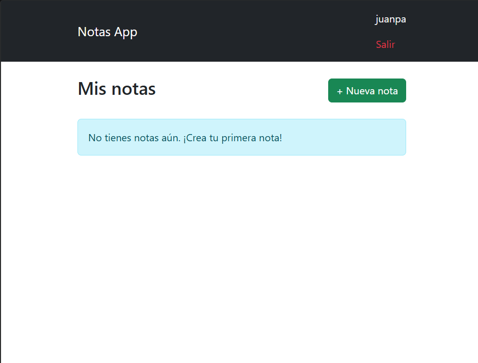

# POO-4TO-CURSO-DJANGO-POSTGRES-REACT

Laboratorio de **Programación Orientada a Objetos (4to curso)** — aplicación cliente/servidor full-stack con Django + React.
-
 · NOMBRE DE LOS INTEGRANTES 
-

Juan Pablo Leon
 · Snaider Ramos
 · Allan Moreno
 · Felipe Alárcon
 · Carlos Vasquez 
-
Ingenieria En Software  ·  4to semestre
-

# Resumen Técnico del Proyecto
1. Preparación del Entorno

Virtualización: Se creó un entorno virtual (.venv) para aislar las dependencias del proyecto.

Instalación: Se instalaron las librerías base necesarias: Django (framework web), mysqlclient (conector de base de datos) y python-decouple (gestión de variables de entorno).

Configuración del Editor: Se configuró VS Code utilizando el intérprete de Python del entorno virtual (.venv/Scripts/python.exe), eliminando advertencias de análisis de código (Pylance).

2. Configuración de Base de Datos (MySQL)

Gestión de Variables: Se implementó un archivo .env para gestionar de forma segura las credenciales (DB_NAME, DB_USER, DB_PASSWORD, DB_HOST, DB_PORT).

Integración: Se ajustó settings.py para leer dichas variables mediante decouple.

Sincronización: Se ejecutó la creación manual del esquema en MySQL (ventas_db_local) y se aplicó la migración inicial del historial de modelos mediante los comandos makemigrations y migrate.

