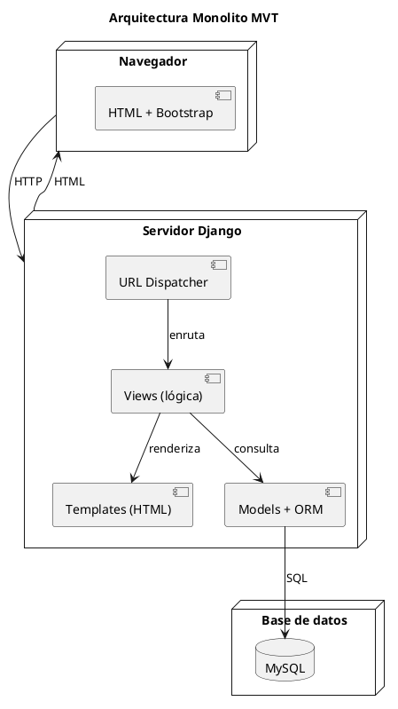
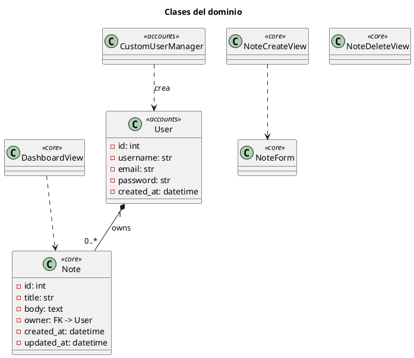
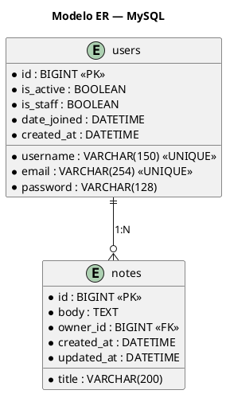
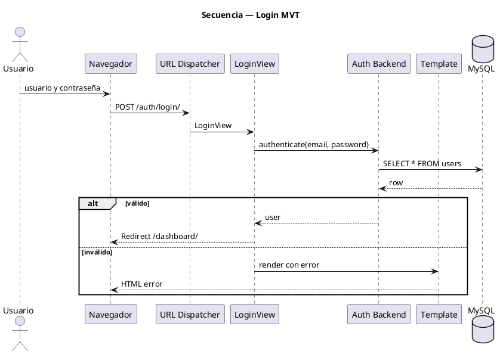

# Guía de Laboratorio 03 — UML + Verificación Final

> **Parte 3 de 3** · ⏱ Duración estimada: **45 min – 1 hora**
> **Asignatura:** Programación Orientada a Objetos (4to curso)
> **Prerrequisito:** [Parte 2 — Backend MVT](./guia-laboratorio-02.md) completada.
> **Alcance:** generar diagramas UML y verificar el sistema completo.

| ⬅️ Anterior | 📘 Esta guía |
|---|---|
| [02 — Backend MVT](./guia-laboratorio-02.md) | **03** UML + Verificación |

---

## 1. Fase 9 — Diagramas UML (PlantUML)

> 💡 **Concepto POO:** un diagrama UML es un contrato visual del sistema. Muestra estructura (clases, ER) y comportamiento (secuencia).

### 1.1 Instalar extensión PlantUML

En VSCode: `Ctrl + Shift + X` → busque **PlantUML** (jebbs) → instale. Para previsualizar: abra el `.puml` y pulse `Alt + D`.

### 1.2 Crear archivos

En `docs/uml/` cree 4 archivos:

```
docs/uml/
├── 01-despliegue.puml
├── 02-clases.puml
├── 03-er-database.puml
└── 04-secuencia-login.puml
```

### 1.3 Diagrama de despliegue

📄 **`docs/uml/01-despliegue.puml`**



### 1.4 Diagrama de clases

📄 **`docs/uml/02-clases.puml`**



### 1.5 Modelo ER

📄 **`docs/uml/03-er-database.puml`**



### 1.6 Diagrama de secuencia (login)

📄 **`docs/uml/04-secuencia-login.puml`**



✅ **Checkpoint:** 4 diagramas creados y renderizan sin errores.

---

## 2. Verificación final

```bash
cd "D:/UNEMI/2026/PERIODO-ABRIL-JUNIO/POO/POO-4TO-CURSO-DJANGO-POSTGRES-REACT/backend"
source .venv/Scripts/activate
python manage.py runserver
```

| # | Criterio | ✅ |
|---|---|---|
| 1 | `python manage.py check` sin errores | ☐ |
| 2 | `showmigrations` todo `[X]` | ☐ |
| 3 | Admin en `/admin/` | ☐ |
| 4 | Registro en `/auth/register/` | ☐ |
| 5 | Login con email y contraseña | ☐ |
| 6 | Dashboard muestra notas del usuario | ☐ |
| 7 | Crear nota funciona | ☐ |
| 8 | Eliminar nota funciona | ☐ |
| 9 | Logout redirige al login | ☐ |
| 10 | Sin sesión → redirect a login | ☐ |
| 11 | Diagramas UML renders OK | ☐ |

---

## Cierre

| Parte | Resultado |
|---|---|
| [01](./guia-laboratorio-01.md) | Django + MySQL |
| [02](./guia-laboratorio-02.md) | MVT: modelos, vistas, templates, auth |
| **03** | UML + verificación |

### Escalabilidad futura (DRF)

Este proyecto está listo para agregar Django REST Framework:

1. `pip install djangorestframework djangorestframework-simplejwt`
2. Agregar `rest_framework` a `INSTALLED_APPS`
3. Crear `serializers.py` + `api_views.py` en cada app
4. Las vistas HTML actuales siguen funcionando en paralelo bajo `/admin/` y `/dashboard/`

*Fin del laboratorio.*
